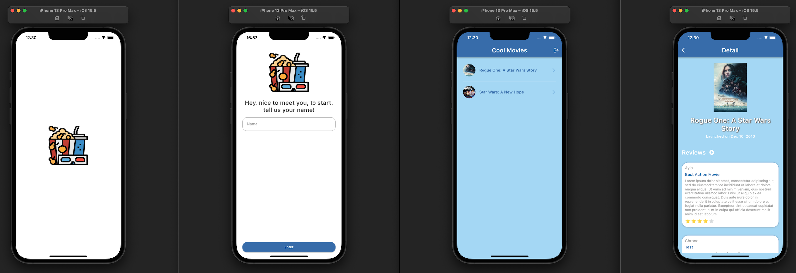

# CoolMovies App

CoolMovies is a mobile application with list of movies and reviews.

## Icon


## Screenshots




## Installation and Run (App and Backend)

Clone the repository using `master` branch.

```bash
git clone git@github.com:Sergiohcp/cool-movies-app.git
```

Go to the project folder and run "pub get" to download dependencies.

```bash
cd coolmovies_app
flutter pub get
```

Go to the project folder and inside of backend folder run docker-compose command.

```bash
cd backend
docker-compose up -d
```

Create a .env file with GRAPHQL_URL variable.

```bash
GRAPHQL_URL=URL
```

Open a simulator (ios or android) and run the application.

```bash
flutter run
```

You can run with specific device, example (iPhone 12 Pro Max):

```bash
flutter devices
flutter run -d 001B1F64-849E-48AA-8C0B-86C37095CDCE
```
Other options is run the application using VsCode or Android Studio / IntelliJ. (Recommended)

## Tests

### Unit and widget tests

To run unit and widget tests just run "flutter test" command passing the path of the test.

```bash
flutter test test/customer_test.dart
flutter test test/button_test.dart
```

## About implementation

1. In this application I used the graphql_flutter library to use the client and perform queries and mutations. I preferred use controllers to perform these request, to make a better separation of the business logic from the screens.

2. The GetX library is used for managing observable states, managing controllers instances and for navigating between the screens wit named routes.

3. The app has unit tests, so the aplication uses flutter_test library.

## Folders

#### /lib
1. **api:** configurantion and instance of graphql client.
2. **bindinds:** instance of repositories and controller to access in pages.
3. **controllers:** global state and methods with application rules.
4. **core:** core files like colors, texts styles, etc.
5. **graphql:** graphql queries and mutations.
6. **mappers:** functions to remap received data from backend.
7. **models:** entities of user, movie, review, etc.
8. **pages:** pages and specific widgets used in pages.
9. **repositories:** methods to access graphql client and perform requests.
7. **utils:** utils from application.
8. **validators:** functions to validate some fields of text form field.
9. **widgets:** shared widgets.

#### /

1**assets:** images and screenshots files.